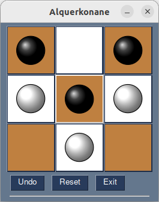

# Alquerkonane

La configuration du jeu est à changer au début du programme (lignes 11 à 13) via les constantes :
```
SIZE = 3
LINE_NUMBER = 2
BLACK_START = False
```
ici c'est un échiquier 3x3 avec deux lignes de pions et les blancs commencent

La constante `GET_WINNER` (ligne 15) est un booléen indiquant si on doit ou non rechercher qui a la position gagnante, si elle est à `False`, le programme permet juste deux jouer une partie entre deux joueurs humains.


**Temps de calcul** : pour un échiquier 5x5 et deux lignes de pions déjà plus de 3 minutes de temps de calcul. La taille du cache dépasse 5 Go. La taille 6x6 avec 2 lignes de pions est hors d'atteinte. 

# Positions gagnantes

| Taille de l'échiquier | Nombre de lignes |Joue en premier  | Gagnant | Illustration      |
|-----------------------|------------------|-----------------|---------|-------------------|
| 3 x 3                 |         2        | black           | black   |  [voir](#Alq3x3-2)|
| 3 x 3                 |         2        | white           | black   |  [voir](#Alq3x3-2)|
| 4 x 4                 |         1        | black           | white   |  [voir](#Alq4x4-1)|
| 4 x 4                 |         1        | white           | black   |  [voir](#Alq4x4-1)|
| 4 x 4                 |         2        | black           | black   |  [voir](#Alq4x4-2)|
| 4 x 4                 |         2        | white           | white   |  [voir](#Alq4x4-2)|
| 5 x 5                 |         2        | black           | black   |  [voir](#Alq5x5-2)|
| 5 x 5                 |         2        | white           | black   |  [voir](#Alq5x5-2)|
| 6 x 6                 |         1        | black           | black   |  [voir](#Alq6x6-1)|
| 6 x 6                 |         1        | white           | white   |  [voir](#Alq6x6-1)|


<a id="Alq3x3-2"></a> 

<a id="Alq4x4-1"></a> 

<a id="Alq4x4-2"></a> 

<a id="Alq5x5-2"></a> 

<a id="Alq6x6-1"></a> 